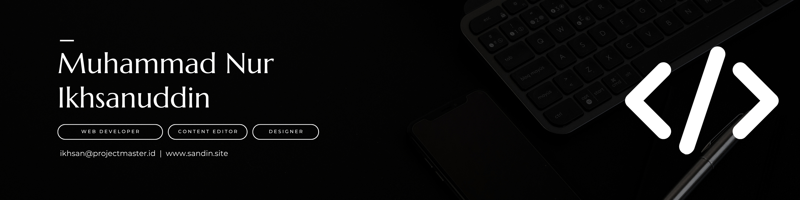

  

<h1 align="center">Hi 👋, I'm Ikhsan</h1>
<h3 align="center">A passionate Full-Stack Developer</h3>

  

 

##  About Me

- 🌱 I'm passionate about **Web Development** and **Content Editing**
- 👨‍🎓 Currently pursuing Bachelor's Degree in **Informatics Engineering**
- 📫 How to reach me: **m.nurikhsanuddin@gmail.com**
- 🌐 Portfolio: **[sandin.site](https://sandin.site)**

## 🛠️ Technologies & Tools

  
  
  
  
  
  
  
  
  
  
  
  
  
  
  

## 📊 GitHub Stats

  

  

## 🌟 Most Used Languages

  

<i>Note: Includes private repository contributions. Actual usage may vary as it's based on GitHub's language detection.</i>

## 📅 Contribution Graph

  

## 🎯 Skills

<table align="center">
  <tr>
    <td valign="top">
      <h3>Frontend</h3>
      <ul>
        <li>React.js</li>
        <li>Next.js</li>
        <li>HTML/CSS/JavaScript</li>
        <li>Tailwind CSS</li>
        <li>UI/UX Design</li>
      </ul>
    </td>
    <td valign="top">
      <h3>Backend</h3>
      <ul>
        <li>PHP (Laravel, CodeIgniter)</li>
        <li>Node.js (Express)</li>
        <li>Python</li>
        <li>RESTful APIs</li>
      </ul>
    </td>
    <td valign="top">
      <h3>Database & Others</h3>
      <ul>
        <li>MySQL</li>
        <li>MongoDB</li>
        <li>Flutter</li>
        <li>Docker</li>
        <li>Content Creation</li>
      </ul>
    </td>
  </tr>
</table>

## 🏆 Certifications:

- Programmer & Software Development Certification from National Agency for Professional Certification

## 🤝 Connect with me

  
  
  
  

---

  

  

  

